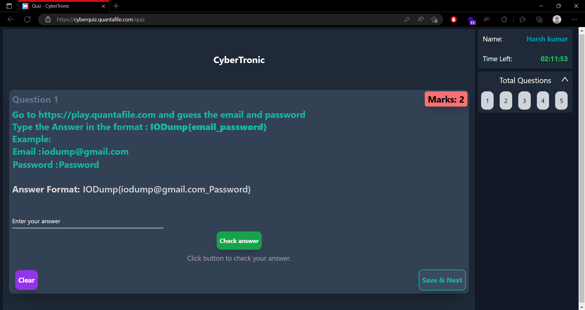
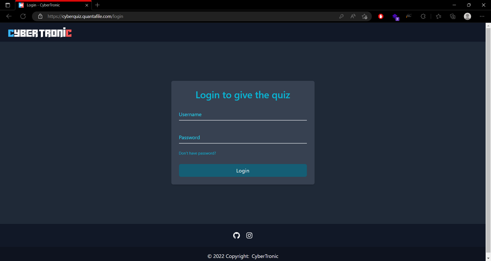
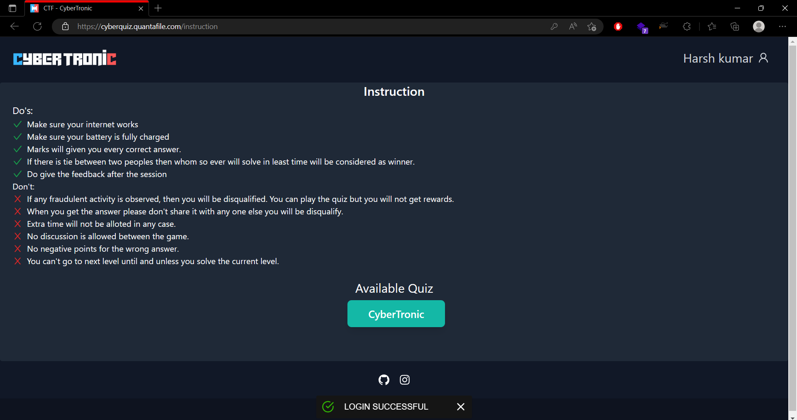
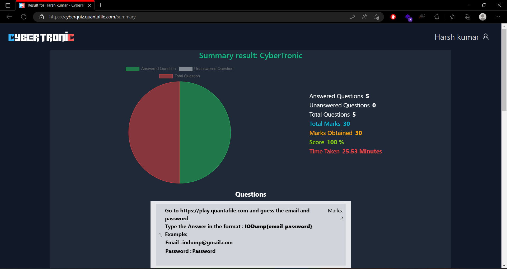

# Cybertronics Website and Quiz 🔥

The Cybertronics website is an event website made for the cyber security event organized by Iodump College Tech Community in the Zeal College of Engineering and Research in CSMA hall. Students can visit the website and register for the event, as well as register to play in the accompanying quiz.

## Technology Used ✨

The website is built with the following technologies:

Backend: Django
Frontend: React.js
The interface of the website is designed using Tailwind CSS, which provides a clean and responsive design across all devices.

## Features
The Cybertronics website includes the following features:

* User registration for the event, with a registration form and a modal for registration.
* User registration for the accompanying quiz, with a username and random password sent to the user upon registration.
* Quiz questions that support both multiple choice and fill in the blank answers.
* Time limit for the quiz, to keep the game competitive.
* Result analysis for users to see how well they performed.

* *About ❓*: This section provides a brief overview of the Hacktoberfest event and the Iodump College Tech Community.

* *Schedule 	📆*: This section lists the schedule for the Hacktoberfest event, including the dates, times, and locations of the different activities.

## Architecture

The architecture of the quiz website can be broken down into the following components:

* *Backend* : The backend is built using Django and Django REST framework. It is responsible for handling all server-side logic, including serving the frontend, handling API requests, and managing the PostgreSQL database. The API is built using Django REST framework and exposes endpoints for user authentication, quiz questions, and quiz results.
* *Frontend* : The frontend is built using React and is responsible for handling all client-side logic. It uses Axios to make requests to the API and React Router for navigation. Tailwind is used for styling.
* *API* : The API is built using Django REST framework and exposes endpoints for user authentication, quiz questions, and quiz results. It uses Django's built-in authentication system to handle user registration and authentication.
* *Database* : The website uses a SQLlite3 database to store all data, including user information, quiz questions, and quiz results. The database is managed by Django's ORM.

## Getting Started 👋
To use the landing page, simply visit the website at [insert URL here] and browse the different sections. To register for the event, click the "Register" button and fill out the registration form in the modal that appears. You will receive an email with your ticket containing a QR code for attendance at the event. If you don't receive your email, you can search for your ticket by clicking the "Search" button and entering your information.

## Contributing
If you'd like to contribute to the landing page, you can do so by submitting a pull request. Please see the CONTRIBUTING.md file for more information on how to contribute.

## License
This project is licensed under the iodump license. See the LICENSE file for more information.

## Contact🤗
If you have any questions or issues with the landing page, please contact the organizers of the Hacktoberfest event using the information provided in the "Contact" section.

## Features

- Registration
- Landing Page
- Responsive

## Screen Shots
Login Page

Instruction Page

Quiz Page

Result Page

## Run Locally

To use this project, you can clone the repository and run it locally on your machine. The following instructions will help you get started:

Clone the repository: git clone https://github.com/yourusername/cybertronics.git.

Navigate into the cloned directory: cd cybertronics.